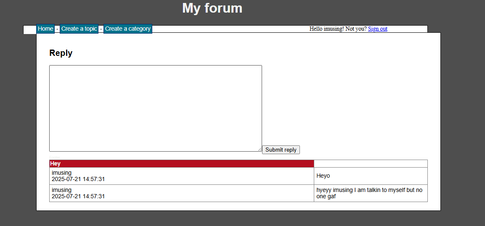

# forum php

forum in php. forked from a 10 year old project, now trying to make it secure. first of all I let chatgpt rewrite the code (mysql -> mysqli)
because else it would be too much work for me (saved like an hour!!!)

